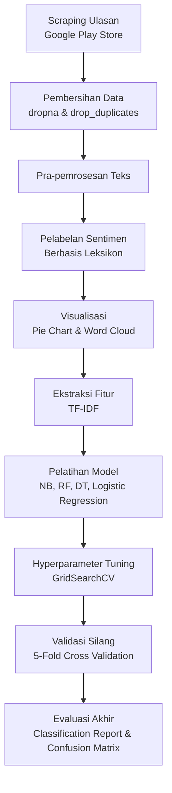

# 🎮 Analisis Sentimen Ulasan Pengguna Honor of Kings

Proyek *Natural Language Processing* (NLP) untuk menganalisis sentimen (**positif** / **negatif**) ulasan pengguna Indonesia terhadap game mobile **Honor of Kings** di Google Play Store. Proyek ini mencakup pipeline lengkap mulai dari *web scraping*, pembersihan & pra-pemrosesan teks, pelabelan berbasis leksikon, hingga pelatihan, penyetelan hyperparameter, dan evaluasi beberapa model *machine learning*.


---

## 📋 Daftar Isi

- [Tentang Proyek](#-tentang-proyek)
- [Objek Analisis: Honor of Kings](#-objek-analisis-honor-of-kings)
- [Struktur Repositori](#-struktur-repositori)
- [Alur Metodologi](#-alur-metodologi)
- [Dataset](#-dataset)
- [Instalasi](#%EF%B8%8F-instalasi)
- [Cara Menjalankan](#-cara-menjalankan)
- [Hasil & Evaluasi Model](#-hasil--evaluasi-model)
- [Teknologi yang Digunakan](#-teknologi-yang-digunakan)
- [Rencana Pengembangan](#-rencana-pengembangan)
- [Kontak](#-kontak)

---

## 📖 Tentang Proyek

Ulasan pengguna di Google Play Store adalah sumber data yang kaya untuk memahami persepsi publik terhadap sebuah aplikasi atau game. Proyek ini bertujuan untuk:

1. **Mengumpulkan** ribuan ulasan berbahasa Indonesia secara otomatis dari Google Play Store.
2. **Membersihkan dan memproses** teks ulasan agar siap dianalisis (case folding, normalisasi kata gaul, tokenisasi, stopword removal).
3. **Melabeli sentimen** setiap ulasan secara otomatis menggunakan pendekatan berbasis **leksikon Bahasa Indonesia** (tanpa anotasi manual).
4. **Melatih dan membandingkan** beberapa algoritma klasifikasi *machine learning* untuk memprediksi sentimen ulasan.
5. **Mengoptimalkan** model terbaik melalui *hyperparameter tuning* dan *cross-validation*.

Proyek ini cocok sebagai referensi/*template* untuk kasus analisis sentimen berbahasa Indonesia berbasis ulasan aplikasi, khususnya yang menggabungkan pendekatan **lexicon-based** dan **machine learning klasik**.

## 🎯 Objek Analisis: Honor of Kings

Data ulasan diambil dari game **[Honor of Kings](https://play.google.com/store/apps/details?id=com.levelinfinite.sgameGlobal)** (`appId`: `com.levelinfinite.sgameGlobal`) — game *mobile MOBA* 5v5 buatan **TiMi Studio Group (Tencent)** yang diterbitkan secara global oleh **Level Infinite**. Game ini merupakan salah satu MOBA mobile terpopuler di dunia dan dirilis secara global pada Juni 2024, termasuk di Indonesia.

## 🗂 Struktur Repositori

```
Sentiment_Analysis/
├── Scrape_Data_HOK.ipynb                      # Notebook untuk scraping ulasan dari Google Play Store
├── Pelatihan_Model_Analisis_Sentimen_HOK.ipynb # Notebook utama: preprocessing, labeling, & pemodelan ML
├── Requirements.txt                            # Daftar dependensi Python
└── README.md                                   # Dokumentasi proyek (file ini)
```

| Berkas | Deskripsi |
|---|---|
| `Scrape_Data_HOK.ipynb` | Mengambil ulasan game menggunakan `google-play-scraper`, lalu menyimpannya sebagai `ulasan_game_HOK.csv`. |
| `Pelatihan_Model_Analisis_Sentimen_HOK.ipynb` | Notebook inti berisi seluruh pipeline: pembersihan data → preprocessing teks → pelabelan sentimen → visualisasi → ekstraksi fitur → pelatihan model → tuning → evaluasi. |
| `Requirements.txt` | Daftar pustaka Python beserta versinya yang dibutuhkan untuk menjalankan kedua notebook. |

## 🔄 Alur Metodologi



### 1. Pengambilan Data (*Scraping*)
Menggunakan pustaka [`google-play-scraper`](https://pypi.org/project/google-play-scraper/) untuk mengambil ulasan aplikasi Honor of Kings (`lang='id'`, `country='id'`, diurutkan `MOST_RELEVANT`), menghasilkan puluhan ribu ulasan mentah yang disimpan ke `ulasan_game_HOK.csv`.

### 2. Pembersihan Data
- Menghapus baris dengan nilai kosong (`dropna`).
- Menghapus ulasan duplikat (`drop_duplicates`).

### 3. Pra-pemrosesan Teks
Serangkaian fungsi custom diterapkan secara berurutan pada tiap ulasan:

| Fungsi | Tugas |
|---|---|
| `cleaningText` | Menghapus mention, hashtag, RT, URL, angka, tanda baca, dan baris baru |
| `casefoldingText` | Mengubah teks menjadi huruf kecil |
| `fix_slangwords` | Menormalisasi kata gaul/tidak baku (mis. `"gk"` → `"tidak"`, `"bgt"` → `"banget"`) menggunakan kamus slang kustom |
| `tokenizingText` | Memecah kalimat menjadi token/kata (NLTK) |
| `filteringText` | Menghapus stopwords Bahasa Indonesia & Inggris (NLTK + daftar tambahan) |
| `toSentence` | Menggabungkan kembali token bersih menjadi kalimat utuh (`text_akhir`) |

### 4. Pelabelan Sentimen Berbasis Leksikon
Menggunakan kamus kata positif & negatif Bahasa Indonesia (dimuat dari [dataset lexicon](https://github.com/angelmetanosaa/dataset)) untuk menghitung skor polaritas tiap ulasan. Skor ≥ 0 dilabeli **positif**, skor < 0 dilabeli **negatif** — sehingga proses pelabelan berlangsung sepenuhnya otomatis tanpa anotasi manual.

### 5. Visualisasi Data
- **Pie chart** distribusi sentimen positif vs negatif.
- **Word Cloud** untuk melihat kata-kata yang paling sering muncul dalam ulasan.

### 6. Ekstraksi Fitur & Pemodelan
Teks bersih diubah menjadi representasi numerik menggunakan **TF-IDF** (`TfidfVectorizer`), kemudian data dibagi 80:20 (train/test) untuk melatih 4 algoritma klasifikasi:

- Multinomial / Bernoulli **Naive Bayes**
- **Random Forest** Classifier
- **Decision Tree** Classifier
- **Logistic Regression**

### 7. Penyetelan Hyperparameter & Validasi Silang
Model terbaik (**Logistic Regression**) dioptimalkan lebih lanjut dengan:
- Konfigurasi TF-IDF baru (`max_features=500`, `ngram_range=(1,2)`, dsb.)
- **GridSearchCV** untuk mencari parameter `C` terbaik
- **5-Fold Cross Validation** untuk memastikan performa model stabil dan tidak *overfitting*

### 8. Evaluasi Akhir
Model terbaik dievaluasi menggunakan **classification report** (precision, recall, F1-score) dan **confusion matrix**, lalu dibandingkan dengan seluruh model sebelumnya.

## 📊 Dataset

Dataset hasil scraping (~99.000 ulasan mentah sebelum dibersihkan) tersedia melalui tautan berikut:

📁 **[Unduh Dataset CSV (Google Drive)](https://drive.google.com/file/d/12osdlwXA62knKh2OAM4KQgzD8nejsQQA/view?usp=sharing)**

Setelah pembersihan (`dropna` + `drop_duplicates`) dan pelabelan berbasis leksikon, distribusi sentimen akhir yang digunakan untuk pemodelan adalah:

| Sentimen | Jumlah Ulasan |
|---|---|
| Negatif | 9.770 |
| Positif | 6.065 |

## ⚙️ Instalasi

1. **Clone repositori ini**
   ```bash
   git clone https://github.com/abiyyufarhan/Sentiment_Analysis.git
   cd Sentiment_Analysis
   ```

2. **(Opsional) Buat virtual environment**
   ```bash
   python -m venv venv
   source venv/bin/activate      # Linux/Mac
   venv\Scripts\activate         # Windows
   ```

3. **Install dependensi**
   ```bash
   pip install -r Requirements.txt
   ```

4. **Unduh resource NLTK yang dibutuhkan** (dijalankan otomatis di dalam notebook, atau jalankan manual):
   ```python
   import nltk
   nltk.download('punkt')
   nltk.download('punkt_tab')
   nltk.download('stopwords')
   ```

## ▶️ Cara Menjalankan

1. Jalankan **`Scrape_Data_HOK.ipynb`** terlebih dahulu untuk mengambil data ulasan terbaru dari Google Play Store, atau langsung gunakan dataset yang sudah tersedia di [tautan Google Drive](#-dataset) di atas.
2. Jalankan **`Pelatihan_Model_Analisis_Sentimen_HOK.ipynb`** secara berurutan dari sel pertama hingga terakhir untuk melakukan preprocessing, pelabelan, pelatihan model, hingga evaluasi.
3. Kedua notebook awalnya dirancang untuk dijalankan di **Google Colab** (terdapat sel `drive.mount`), sehingga sesuaikan path file CSV bila dijalankan secara lokal/Jupyter biasa.

## 🏆 Hasil & Evaluasi Model

Perbandingan akurasi (*test accuracy*) dari seluruh model yang diuji pada data uji (20%):

| Model | Akurasi Uji |
|---|---|
| Multinomial Naive Bayes | 76,31% |
| Decision Tree Classifier | 75,97% |
| Random Forest Classifier | 81,14% |
| Logistic Regression | 83,23% |
| **Logistic Regression (tuned, TF-IDF unigram+bigram)** | **86,80%** |

**Logistic Regression** menjadi model dengan performa terbaik. Setelah dilakukan *hyperparameter tuning* dengan `GridSearchCV` (parameter terbaik `C=10.0`) dan divalidasi dengan **5-Fold Cross Validation** (rata-rata skor **87,51%**), model ini mencapai **akurasi uji akhir sebesar 86,80%** — meningkat signifikan dari model dasarnya (83,23%) berkat kombinasi TF-IDF *unigram + bigram* dan penyetelan parameter regularisasi.

## 🛠 Teknologi yang Digunakan

| Kategori | Pustaka |
|---|---|
| Pengambilan Data | `google-play-scraper` |
| Manipulasi Data | `pandas`, `numpy` |
| Pra-pemrosesan Teks | `nltk`, `Sastrawi`, `re`, `string` |
| Visualisasi | `matplotlib`, `seaborn`, `wordcloud` |
| Machine Learning | `scikit-learn` (TF-IDF, Naive Bayes, Random Forest, Decision Tree, Logistic Regression, GridSearchCV) |
| Lingkungan | Jupyter Notebook / Google Colab |

## 🚀 Rencana Pengembangan

- [ ] Menambahkan label **netral** pada proses pelabelan berbasis leksikon.
- [ ] Mencoba pendekatan *deep learning* (LSTM, BiLSTM, atau fine-tuning **IndoBERT**) untuk membandingkan performa dengan model klasik.
- [ ] Menyimpan model terbaik (`pickle`/`joblib`) agar dapat digunakan untuk inferensi tanpa melatih ulang.
- [ ] Membangun antarmuka sederhana (mis. Streamlit) untuk demo prediksi sentimen secara *real-time*.
- [ ] Menambahkan *unit test* dan modularisasi kode preprocessing ke dalam skrip `.py` terpisah.

## 📬 Kontak

Dibuat oleh **[@abiyyufarhan](https://github.com/abiyyufarhan)**.

Untuk pertanyaan, saran, atau kontribusi, silakan buka [Issue](https://github.com/abiyyufarhan/Sentiment_Analysis/issues) baru di repositori ini.

---

<p align="center"><i>⭐ Jangan lupa beri bintang pada repositori ini jika bermanfaat!</i></p>
